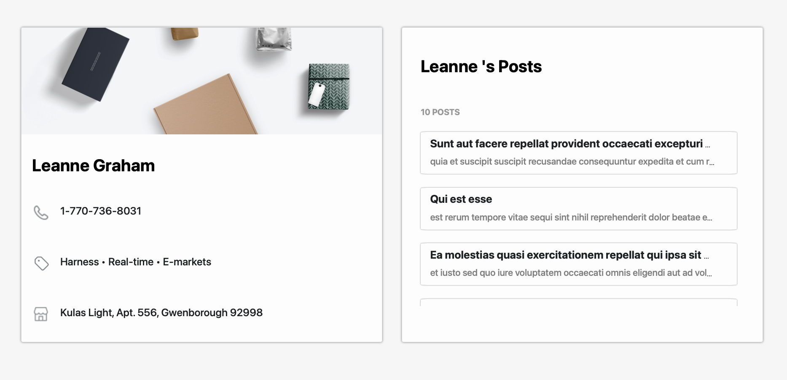

# vue-tinvio_webpage

### Compiles and hot-reloads for development
```
1. Ensure you have npm and node installed
2. Clone github repo url to visual studio code
3. Open the cloned directory in visual studio code
4. Input comand in local terminal: npm run serve
5. Copy the localhost address to your browser
```

### All objectives that have been attempted
```
All the required objectives other than the optional ones
```

### Time spent on the assignment
```
5 hours
```
### Finished Product SreenShot

